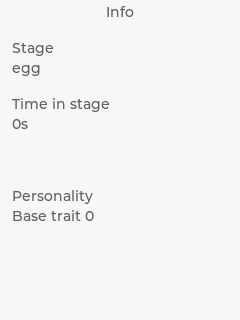
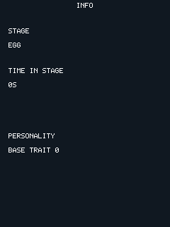

# ADR 0045: Info leaves LVGL for a `kf.screen()` group, and LVGL leaves the default build

**Status:** Accepted
**Date:** 2026-08-13

## Context

Task 2 of the screens/clock/sleep plan — the
owner's number one, stated plainly when deciding what to build next:
*"first up then is doing the info screen in LUA to see if it can be done."*
If it comes out clean, LVGL's last real reason to exist in a running build
disappears, and the 256 KB `KF_ARENA_LVGL` PSRAM arena comes back. ADR 0044
(Task 1, this same plan) built the mechanism this task needed first:
`kf.screen(name)`, a named group of scene objects over the one retained
scene, and a register-by-name navigation registry Lua can reach through.

Before this task, `kf_pet_info_screen.cpp` (183 lines) was a pure LVGL
widget tree — five `lv_obj_t*`/`lv_label_*` calls, no framebuffer drawing at
all — showing five things read from `kf_pet_state`: the life stage, how
long the pet has been in that stage, which branch it took (once it has
taken one), and its personality (base trait always, the dominant
care-derived trait once past Egg). `kf_pet_info_screen.cpp:118-131`
documented two blank-until-meaningful rules worth carrying forward
verbatim, since they are not obvious from the fields alone:

- The branch line is empty before TEEN. `teen_form`/`adult_branch` are
  meaningless zeros before their branch point is reached (`kf/pet.h`'s own
  `kf_pet_state` comment), and showing "Teen form 0" before any branching
  care has happened would invent a name for something that has not been
  decided yet — the exact kind of premature content the demo creature's own
  comment header already forbids for teen/adult branch names.
- The care trait is omitted while still an egg. `kf_pet_dominant_care_trait()`
  defaults to 0 (hunger-leaning) before any real care has accumulated
  (ADR 0023's tie-break rule) — a true but meaningless number for a pet that
  has never been fed, played with, rested or bathed. Base trait, rolled once
  at `kf_pet_init()`, is meaningful from the moment a pet exists and is
  always shown.

## Decision

### Info is eight text objects in `examples/creature_demo/creature.lua`

A title, `STAGE` caption and value, `TIME IN STAGE` caption and value, the
branch line, `PERSONALITY` caption and the trait line — the same eight
pieces of content the LVGL screen showed, declared through
`kf.screen("info")` the same way Home already declares itself through
`kf.screen("home")`. Everything it reads was already in the `pet.*`
binding except one field: `pet.stage_seconds()` was added
(`sdk/lua/kf_lua_port.cpp`), a thin wrapper over
`kf_pet_state::stage_elapsed_seconds` — the one gap the plan predicted
correctly. **Nothing else needed reaching past the Lua API for.** The
duration formatter (`"2D 4H"` / `"3H 12M"` / `"5M 09S"` / `"42S"`), the
stage-name lookup, and the two blank-until-meaningful branches all express
cleanly in plain Lua string logic against the existing `pet.*` reads.

Declared **unconditionally**, unlike Home's block — Info does not care
which build owns the creature's own screen (`kf.home_screen_active()`), so
it is not gated behind that flag. It registers as screen index 1 (Home
always registers first, by `kf_screen_nav_init()`'s own long-standing
contract), matching the pixel-identical navigation order the old two-entry
array had.

### The duration formatter moves to Lua, uppercase — the expected, deliberate pixel change

`kf_pet_info_screen.cpp`'s `set_duration_label()` produced `"2d 4h"`,
lowercase; the bitmap font (`kf/font.h`) has no lowercase glyphs at all
(uppercase, digits, space, and `. , : - / % + (` `)` only — see that
header's own comment on why lowercase was left out). `kf_lua_scene.cpp`'s
text binding already uppercases every string a script sets
(`uppercase_and_warn()`), so the format string itself just needed to stop
assuming a case the target font cannot draw. This is the one real, visible
difference between the old screen and the new one, and it is why
`screen_nav_check`'s golden checksum moves — see "The golden checksum
that moved, and the evidence" below.

### The API gap that would have mattered, and didn't turn out to be one: per-screen refresh

`kf.screen()` groups share ONE frame-update mechanism with Home:
`kf_screen_nav_frame()` calls whichever screen is active's own registered
`update` callback. Before this task, only Home had one
(`kf_lua_home_screen_frame()`, which calls the shared `on_frame(dt_ms)`).
Giving Info the identical treatment — call `on_frame()` while Info is
active too — looked like the obvious move, and it is wrong in a way that
only shows up once a SECOND `kf.screen()` group exists: creature.lua's
`on_frame()` unconditionally mutates Home's own scene objects whenever
`kf.home_screen_active()` is true (`body:show()`/`shrine:hide()`/poop
visibility, reflecting whether the pet is alive), regardless of which
screen the player is actually looking at. That collides with
`kf_lua_scene_activate_screen()`'s own visibility bookkeeping: switching TO
Info hides Home's objects, and the very next frame's `on_frame()` call
un-hides Home's placeholder creature sprite on top of Info. Found rendering
Info for the first time this task, not designed around in advance — see
"Two real bugs found rendering Info for the first time" below.

**This is not a case where the Lua API itself was missing something a
script could express.** It is a C-side wiring choice (which native
function a screen's per-frame callback calls) that had exactly one wrong
answer once two screens shared it. The fix is `kf_lua_port_info_frame()`
(`sdk/lua/kf_lua_port.{h,cpp}`) — the same shape as `kf_lua_port_frame()`,
calling a SEPARATE script global, `on_info_frame(dt_ms)`, instead of
`on_frame()`. Info's own C-side update callback
(`kf_lua_info_screen_frame()`, `simulator/src/pet/kf_lua_home_screen.cpp`)
calls this instead of the shared one. No buttons dispatched from it either
— Info has none, matching `kf_pet_info_screen.h`'s original "no
interactive widgets, no LVGL group" note about the screen it replaces.
Each screen's own per-frame logic now only ever touches that screen's own
objects; no query for "which screen is currently active" was added to the
Lua surface, and none was needed.

### Two real bugs found rendering Info for the first time

Both are latent gaps in ADR 0044's own mechanism, exposed the moment a
SECOND `kf.screen()` group existed — Task 1's own test
(`run_screen_group_check()`) never triggers either, because its script
calls `a:show()` on frame 1, before anything is ever hashed, so it never
observes the state between script-load and the first explicit switch.

1. **Nothing ever hid a second screen's objects at boot.** A script's
   top-level `kf.screen()` calls create every object visible-by-default
   (`kf/scene.h`'s own rule), and the only thing that ever hides an
   inactive group — `kf_lua_scene_activate_screen()` — runs from inside
   `kf_screen_nav_show()`, which nothing calls until the first real
   switch. One `kf.screen()` group never showed this (there was nothing
   else to hide it FROM); Info, the second, sat fully visible on top of
   Home from the very first frame. Fixed with
   `kf_lua_scene_hide_other_screens()` (`sdk/lua/kf_lua_scene.{h,cpp}`),
   called once by `kf_lua_port_init()` right after a script's top-level
   code finishes declaring every group it ever will. Deliberately NOT the
   full `kf_lua_scene_activate_screen()` — see the next bug for why.
2. **The lighter fix can't force a repaint, because it can't assume a
   framebuffer exists.** `kf_lua_port_init()` is generic Lua glue several
   headless checks call with no rendering surface at all
   (`run_lua_creature_check()` among them — a logic-only proof that never
   calls `kf_fb_init()`). `kf_lua_scene_activate_screen()`'s own
   `kf_scene_commit()` call asserts a framebuffer exists; calling it
   unconditionally from `kf_lua_port_init()` crashed that check with `kf_fb_pixels
   before kf_fb_init`. `kf_lua_scene_hide_other_screens()` sets ONLY the
   `visible` flags, no repaint — safe with no framebuffer, and correct
   regardless: `hakoniwaos/src/scene.cpp`'s own `g_force_full_redraw`
   already starts true and stays true until the process's first REAL
   `kf_scene_commit()`, so whichever caller eventually does have a
   framebuffer gets a correct first paint from these flags with no extra
   work.

### `KF_ENABLE_LVGL`, default OFF, on both build systems

A CMake option, not a deletion — `CLAUDE.md` names "LVGL vs a custom
sprite engine" a deliberate later evaluation, and deleting the dependency
would foreclose it. With it OFF (the default, both targets):
`kamiframe_lvgl_port` (desktop) / the `kamiframe_lvgl_port` ESP-IDF
component are not built at all, `lvgl_determinism_check` and
`pet_screen_check` are not registered, and `KF_ARENA_LVGL` does not exist
in `kf/arena.h`'s enum — not merely sized to zero, genuinely absent, so
`kf/budget.h`'s PSRAM assertion is recomputed without that term. With it
ON, everything builds and passes exactly as before.

**`kf_pet_screen.cpp` is not deleted.** It survives as `pet_screen_check`'s
subject, exercised only under `-DKF_ENABLE_LVGL=ON`. Deleting it and
retiring that test (and `lvgl_determinism_check`) is a real, defensible
follow-up, and it is Chris's call, not this task's, for the identical
`CLAUDE.md` reason.

**Three files moved out of `simulator/src/lvgl/`, not just the two the
task's own file list named** — `kf_screen_nav.{cpp,h}` (named explicitly),
plus `kf_lua_home_screen.{cpp,h}` and `kf_error_banner.{cpp,h}` (not named,
added here because the reasoning is identical). All three moved to
`simulator/src/pet/` on desktop, and are compiled straight into ESP32's
`main` component by relative path (the same one-canonical-copy pattern
`kf_pet_session.cpp` already used there) — none of the three has ever had
an LVGL dependency of its own; they lived in `simulator/src/lvgl/` only
because `kf_screen_nav.cpp` used to `#include <lvgl.h>` for Info's
`lv_screen_load()`/`lv_obj_invalidate()` calls. Once that dependency left
with `kf_screen_nav.cpp`, leaving the other two behind (both needed
unconditionally, since Home's Lua implementation and the error banner exist
regardless of `KF_ENABLE_LVGL`) would have made the default desktop build
fail to link. Desktop gets a new small library, `kamiframe_screen_port`,
sitting above both `kamiframe_pet_port` and `kamiframe_lua_port` — the same
position `kamiframe_lvgl_port` occupied before this task, and for the
identical reason: these three files need BOTH Home implementations (C++
and Lua), and `kamiframe_lua_port` already depends on `kamiframe_pet_port`,
so folding them into either one directly would create a straight cycle.

### `kf_screen_nav.cpp` loses everything LVGL-shaped

`<lvgl.h>`, `ScreenEntry::root`, the `lv_screen_load()`/`lv_obj_invalidate()`
pair, and `kf_screen_nav_wants_lvgl()` are all gone — every screen this file
can show is a `kf.screen()` group now, so there is nothing left to pump
LVGL for regardless of which one is active. `sdl_main.cpp` and
`app_main.cpp`'s own `kf_lvgl_port_pump()` calls are `#ifdef
KF_ENABLE_LVGL` now, unconditional on which screen is showing (there is
nothing left for that predicate to gate). The long comment in `show()`
explaining LVGL's dirty-tracking two-call requirement for Info specifically
is deleted with the code it described, not left describing machinery that
no longer exists.

### An ESP32 build-system trap: a component's `REQUIRES` cannot depend on a plain CMake variable

Found the hard way — a real `idf.py build` failure (`kamiframe_lvgl_port
component(s) is not in the requirements list of "main"`), not guessed, and
confirmed by instrumenting `ports/esp32/main/CMakeLists.txt` with a
`message(STATUS ...)` and watching it print `ports/esp32/main/CMakeLists.txt`
running **twice**, with `KF_ENABLE_LVGL` in two different states: empty on
the first pass, correctly `ON` on the second. ESP-IDF's own
`component_get_requirements.cmake` (`~/esp/esp-idf/tools/cmake/scripts/`)
runs a lightweight scan of every candidate component's `CMakeLists.txt` in
a genuinely **separate `cmake -P` process**, ahead of the real configure,
to discover each component's `REQUIRES`/`PRIV_REQUIRES` before anything
else happens. That process inherits none of the parent configure's CMake
variables or cache — only whatever ESP-IDF explicitly threads through as
generated property files, which a plain custom `CACHE` variable is not one
of. The SECOND pass (the real configure) sees the correct value and
compiles `-DKF_ENABLE_LVGL=1` correctly everywhere — but the cross-component
"who may include whose headers" graph is decided by the FIRST pass's wrong
answer, and that is what the linker-adjacent error actually reports.

The fix: `ports/esp32/CMakeLists.txt` also exports the value into the
process **environment** (`set(ENV{KF_ENABLE_LVGL} "${KF_ENABLE_LVGL}")`),
and `main/CMakeLists.txt` reads `$ENV{KF_ENABLE_LVGL}` instead of the plain
CACHE variable when deciding whether to append `kamiframe_lvgl_port` to its
own `REQUIRES` list. Environment variables cross the process boundary the
scan's separate `cmake -P` invocation needs; CMake variables do not.
`EXTRA_COMPONENT_DIRS` (which correctly decides whether the
`kamiframe_lvgl_port` component exists at all) did not need this fix,
because that decision is made directly in the top-level project file,
before any component scanning begins — the trap is specific to a
COMPONENT's own `REQUIRES` list, not to whether ESP-IDF discovers the
component in the first place.

## The golden checksum that moved, and the evidence

`screen_nav_check`'s golden constant moved from `ac44bb9819809bea` to
`ca97615c1cd56b73` (`simulator/CMakeLists.txt`) — the only circumstance in
this project's history where a golden constant is deliberately
re-baselined rather than treated as a regression, and the evidence is the
price of it, per this task's own instructions.

**Before** (`kf_pet_info_screen.cpp`, LVGL's default font, lowercase):

**After** (eight `kf.screen("info")` text objects, the bitmap font,
uppercase, drawn by the same blitter that draws the creature):

Both captured via `kamiframe-headless --verify-screen-nav --dump-fb-info
PATH` — a new flag (`simulator/src/headless/headless_main.cpp`), the same
idea as the pre-existing `--dump-fb` for Home, aimed at Info instead. The
"before" image was captured from this worktree's own pre-Task-2 commit
(`0e2acfd`, checked out into a scratch `git worktree` specifically to
render it, since the LVGL Info screen no longer exists in this tree after
the deletion below) with the identical flag temporarily patched in for the
capture, confirmed against the OLD golden constant (`ac44bb9819809bea`)
before trusting the screenshot.

## Consequences

- **Info scene slots: 8** — matches ADR 0044's own budget line item
  exactly (`8` of the `47/64` projected total for Home + Info + the
  not-yet-built Settings). `kf_scene_live_object_count()` was not asserted
  against a new total for the interactive script (that mechanism is
  `run_screen_group_check()`'s own, over its unrelated inline test
  script) — this task did not need to add one, since 8 is small,
  independently verified by counting the `info:text()`/`info:sprite()`
  calls in `creature.lua`, and there is no risk of silently drifting.
- **Worst dirty-rect count: still 3.** Measured directly: switch to Info,
  jump the pet to TEEN (`kf_pet_session_debug_jump_to_stage`), which
  changes Info's stage text, its time-in-stage text (resets to `0S`), and
  its branch line (blank -> `"TEEN FORM 1"`) on the very same frame — the
  worst case Info itself can produce. `kf_fb_dirty_rects().count` peaked at
  3 that frame, tied with (not exceeding) the existing system-wide worst.
  `KF_MAX_DIRTY_RECTS` stays 8 with real headroom.
- **Firmware size** (`-DKF_PANEL=ili9341`, both measured from this exact
  worktree): `KF_ENABLE_LVGL=OFF` (default) — **501,808 bytes**
  (`0x7a830`). `KF_ENABLE_LVGL=ON` — **671,168 bytes** (`0xa3dc0`), a
  **169,360 byte** difference — LVGL's own code plus `kf_pet_screen.cpp`
  plus `kf_lvgl_proof_screen.cpp`, all absent from the default image.
- **PSRAM: 262,144 bytes (256 KiB) reclaimed**, exactly `KF_ARENA_LVGL_BYTES`
  — a compile-time constant, not something that needed a live boot log to
  confirm: with `KF_ENABLE_LVGL` off, `kf/arena.h`'s enum genuinely does not
  have a `KF_ARENA_LVGL` entry, so `hakoniwaos/src/arena.cpp`'s
  `kf_arena_init_all()` never asks the PSRAM pool for that block at all.
  **Not independently confirmed against a real device's `KFDBG STATE`
  `heap_free_psram` reading this task** — no hardware session ran; the
  figure is the arena definition's own size, which is exact by
  construction, not a measurement subject to drift.
- **Desktop suite:** `KF_ENABLE_LVGL=OFF` (default) — **44/44**.
  `KF_ENABLE_LVGL=ON` — **46/46**, unchanged from ADR 0044's own count
  (the default build's number goes down by exactly the two LVGL-only
  tests, which is correct, not a regression).
- **ESP32** (`-DKF_PANEL=ili9341`): both `KF_ENABLE_LVGL=OFF` and `=ON`
  build clean, zero warnings, confirmed by two full `idf.py build` runs
  each against the final code in this task.
- `screen_parity_check` still passes, unaffected — Info is not part of it
  by design (Home-only, cpp vs. lua).
- `sdk/lua/kf_lua_port.h`/`.cpp` gained `kf_lua_port_info_frame()`;
  `sdk/lua/kf_lua_scene.h`/`.cpp` gained
  `kf_lua_scene_hide_other_screens()`. Both documented in place with the
  bug each one closes, not just what it does.
- `examples/creature_demo/creature.lua` gained the `info` screen block and
  a global `on_info_frame(dt_ms)` — a new script-visible convention (a
  second, separate per-screen frame hook, alongside `on_frame`), the first
  of what could become a general "one hook per named screen" pattern if a
  future Settings screen needs the same isolation. Not generalised into a
  registration API this task — one additional named hook, not a framework,
  matching the "smallest change that is still correct" bar the rest of
  this codebase holds itself to.

## Not verified

No `kf.screen("info")` group has rendered on real hardware, and
`heap_free_psram`'s reclaimed 262,144 bytes has not been read from a real
device's `KFDBG STATE` reply — both are desktop/headless and ESP32
cross-compile proofs only, the same honesty ADR 0044 states about its own
work. The ESP32 `KF_HOME_SCREEN=cpp` build variant (the parity
reference/fallback) was not exercised this task, on either `KF_ENABLE_LVGL`
setting — out of scope for the default build this task targets, and,
unlike `KF_ENABLE_LVGL`, not something this task's own changes to
`kf_screen_nav.cpp`/`creature.lua` had reason to disturb.
